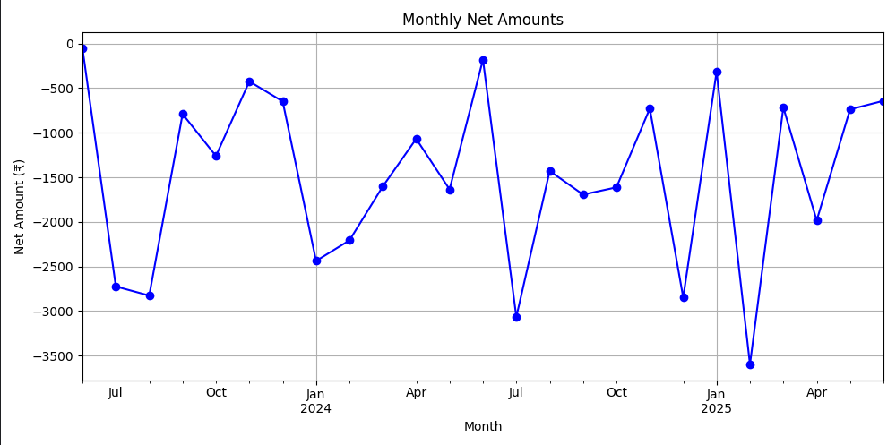
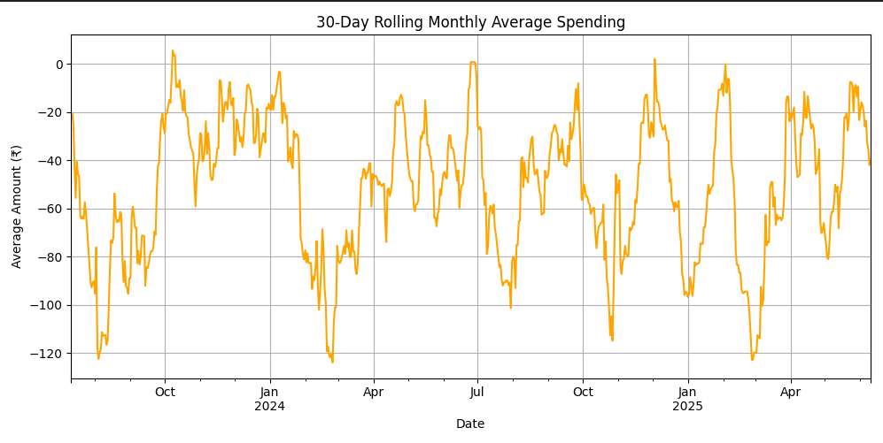
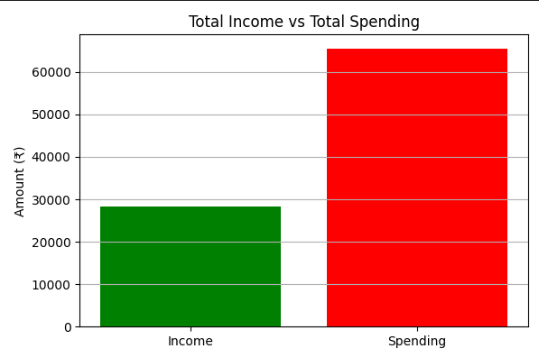
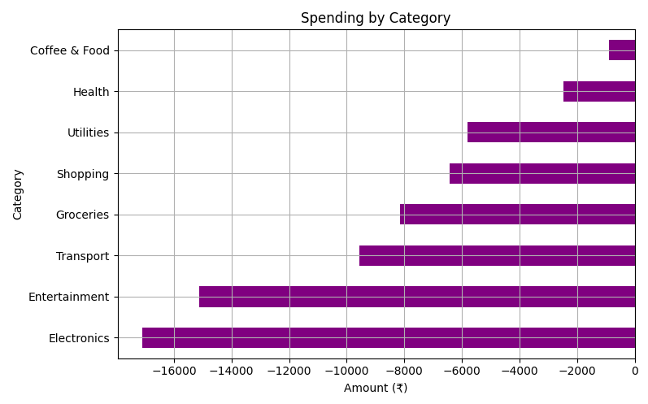
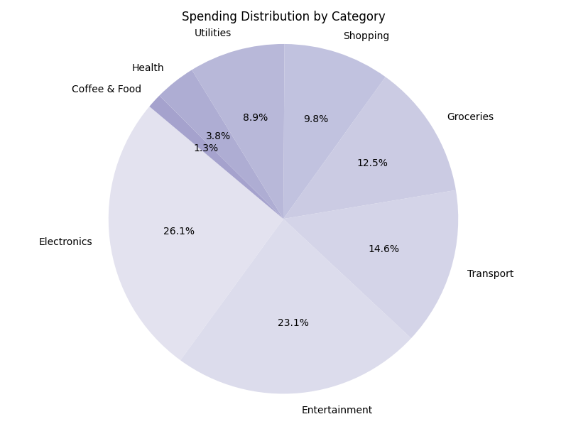
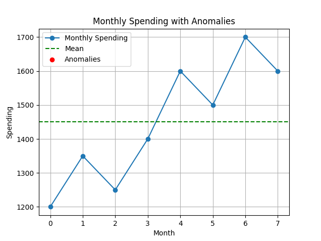

# Personalized-Financial-Analysis-Tool
The financial analysis project aims to help individuals or small businesses better understand and manage their finances by analyzing income and expense data. The core problem it addresses is the difficulty people face in tracking their spending habits, identifying overspending areas, and making informed financial decisions. This project solves the problem by processing transaction data—such as date, amount, category, and type (income or expense)—and performing detailed analysis to uncover meaningful insights. Key analyses include calculating total income and expenses, evaluating cash flow, identifying the top spending categories, and visualizing monthly financial trends. These insights are displayed through an interactive Streamlit dashboard, while all core data processing and calculations are handled in a separate Python module (Financial_Analysis.py). The dashboard features dynamic charts and summaries that allow users to explore their financial behavior over time, spot unusual spending patterns, and assess their savings rate. Overall, the project transforms raw financial data into clear, actionable insights that empower users to take control of their financial well-being.

